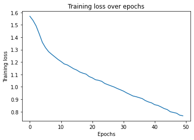
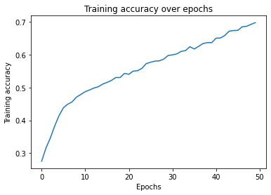

# BERT Sentiment Analysis 

BERT Sentiment Analysis using [huggingface](https://huggingface.co/). 

- Albert on [Colab](https://colab.research.google.com/drive/1rd4h-bXPWgUYmXqVENB9SF2md9uyWSfb?usp=sharing)

## Dataset

Kaggle [Sentiment Analysis on Movie Reviews training set](https://www.kaggle.com/c/sentiment-analysis-on-movie-reviews/data?select=train.tsv.zip).

Download and unzip the file, put it under `data/` folder, and name it `data.tsv`.

For Albert, we reduced the dataset to only keep the original sentence as input (instead of parts of the same sentence). As a result, there are only 8529 input-output pairs in the dataset we use.

## Usage

```bash
# Create & activate conda environment
$ conda env create -f env.yml
$ conda activate bert-sentiment-analysis

# Train & test with default params
$ python main.py data/data.tsv output/model.pt

# Train with other settings, see help
$ python main.py -h
```

## Training Info & Results

Albert:

```bash
BATCH_SIZE: 32
SEQ_LENGTH: 128
HIDDEN_DIM: 256
LR: 1e-06
DROPOUT: 0.2
EPOCHS: 50
LOG_INTERVAL: 10
Training set size: 6823
Test set size: 1706
```




Test set: Average loss: 1.3279, Accuracy: 795/1706 (47%)
